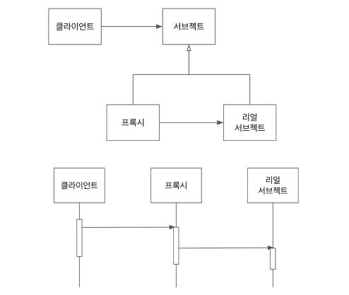

# 더 자바 코드를 조작하는 다양한 방법

[Inflearn. 더 자바 코드를 조작하는 다양한 방법](https://www.inflearn.com/course/the-java-code-manipulation)

## 1장 : JVM(Java Virtual Machine)

- https://medium.com/webeveloper/jvm-java-virtual-machine-architecture-94b914e93d86

## 2장 : 바이트 코드 조작

### 코드 커버리지는 어떻게 측정할까?

- 코드 커버리지(Code Coverage)
  - 테스트 코드가 내 소스 코드를 얼만큼 Cover 하는지 퍼센트(%) 로 나타낸것
  
#### JaCoCo 
  
- 의존성 추가
  
```xml
<plugin> 
    <groupId>org.jacoco</groupId> 
    <artifactId>jacoco-maven-plugin</artifactId> 
    <version>0.8.4</version> 
    <executions> 
        <execution> 
            <goals> 
                <goal>prepare-agent</goal> 
            </goals> 
        </execution> 
        <execution> 
            <id>report</id> 
            <phase>prepare-package</phase> 
            <goals> 
                <goal>report</goal> 
            </goals> 
        </execution> 
    </executions> 
</plugin> 
```

- 메이븐 빌드
  - mvn clean verify 

- 코드 커버리지 실패할 경우 빌드 실패 하도록 설정

```xml
<execution> 
    <id>jacoco-check</id> 
    <goals> 
        <goal>check</goal> 
    </goals> 
    <configuration> 
        <rules> 

           <rule> 
                <element>PACKAGE</element> 
                <limits> 
                    <limit> 
                        <counter>LINE</counter> 
                        <value>COVEREDRATIO</value> 
                        <minimum>0.50</minimum> 
                    </limit> 
                </limits> 
            </rule> 
        </rules> 
    </configuration> 
</execution> 
``` 

- 실행된 결과 확인
  - target
    - site
      - jacoco
        - index.html (우클릭, Run)
 

> https://www.eclemma.org/jacoco/trunk/doc/index.html
>
> http://www.semdesigns.com/Company/Publications/TestCoverage.pdf

### 모자에서 토끼를 꺼내는 마술

```java
public class Moja {
  public String pullOut() {
    return "";
  }
}

public class Masulsa {
  public static void main(String[] args) {
    System.out.println(new Moja().pullOut());
  }
}
```

- Maven Repository 에서 ByteBuddy 검색해서 의존성 추가

```java
public class Masulsa {
  public static void main(String[] args) {
    try{
      new ByteBuddy().redefine(Moja.class)
        .method(named("pullOut")).intercept(FixedValue.value("Rabbit"))
        .make().saveIn(new File(""Moja.class 파일이 존재하는 classes 까지의 경로")) // 해당 경로로 내용이 들어감
    } catch (Exception e) {
     throw new RuntimeException();
    }
  }
}
```

해당 소스를 컴파일 시켜 동작시키고, 그 다음 System.out.println(new Moja().pullOut()); 하면 Rabbit 이 나온다. ByteBuddy 도 내부적으로 asm 을
사용한다.

해당 소스와 Sysout 을 같이 사용하면 위에서 먼저 Moja.class 로 한번 읽었기 때문에 sysout 에서 다시 클래스 로딩을 하지 않는다.

- 바이트 조작 라이브러리
 - ASM: https://asm.ow2.io/ 
 - Javassist: https://www.javassist.org/ 
 - ByteBuddy: https://bytebuddy.net/#/ 
 
### javaagent

javaagent 를 이용하면 System.out.println(new Moja().pullOut()); 만 작성하더라도 Rabbit 을 출력할 수 있다.

- javaagent JAR 파일 만들기
  - https://docs.oracle.com/javase/8/docs/api/java/lang/instrument/package-summary.html 
  - 붙이는 방식은 시작시 붙이는 방식 premain 과 런타임 중에 동적으로 붙이는 방식 agentmain 이 있다. 
  - Instrumentation 을 사용한다.

- pom.xml

```xml
<dependencies> 
    <dependency> 
      <groupId>net.bytebuddy</groupId> 
      <artifactId>byte-buddy</artifactId> 
      <version>1.10.1</version> 
    </dependency> 
</dependencies> 


 <build> 
    <plugins> 
      <plugin> 
        <groupId>org.apache.maven.plugins</groupId> 
        <artifactId>maven-jar-plugin</artifactId> 
        <version>3.1.2</version> 
        <configuration> 
          <archive> 

           <index>true</index> 
            <manifest> 
              <addClasspath>true</addClasspath> 
            </manifest> 
            <manifestEntries> 
              <mode>development</mode> 
              <url>${project.url}</url> 
              <key>value</key> 
              <Premain-Class>me.whiteship.MasulsaAgent</Premain-Class> 
              <Can-Redefine-Classes>true</Can-Redefine-Classes> 
              <Can-Retransform-Classes>true</Can-Retransform-Classes> 
            </manifestEntries> 
          </archive> 
        </configuration> 
      </plugin> 
    </plugins> 
  </build>
```

- javaagent 경로 (각자 맞춰야함)
  - `-javaagent:/Users/keesun/workspace/MasulsaJavaAgent/target/MasulsaAgent-1.0-SNAPSHO T.ja`
  
```java
public class MasulsaAgent   { 
     public static void premain(String agentArgs, Instrumentation inst)   { 
          new AgentBuilder.Default() 
                .type(ElementMatchers.any()) 
                .transform((builder, typeDescription, classLoader, javaModule) -> 
                 builder.method(named("pullOut")).intercept(FixedValue.value("Rabbit!"))).installOn(inst); 
     } 
} 
```

### 바이트코드 툴 활용 예

> 자바 소스 코드를 건드리지 않아야 하는 경우

- 프로그램 분석
  - 코드의 복잡도 계산
  - 코드에서 버그 찾는 툴
  
- 클래스 파일 생성
  - 프록시
  - 특정 API 호출 접근 제한
  - 스칼라 같은 언어의 컴파일러
  
- 프로파일러
- 최적화
- 로깅

#### 스프링이 컴포넌트 스캔을 하는 방법

- 컴포넌트 스캔으로 빈으로 등록할 후보 클래스 정보를 찾는데 사용 (ASM 사용)
  - ClassPathScanningCandidateComponentProvider -> SimpleMetadataReader(ClassReader 와 Visitor 구현체 사용 하여 메타 데이터를 읽는다.) 

> https://www.youtube.com/watch?v=39kdr1mNZ_s

## 3장 : 스프링은 DI 는 어떻게 동작할까?

```java
@Service 
@RequiredArgsConstructor
public class  BookService   { 
 
  private final BookRepository bookRepository; 
 
} 
```

어떻게 bookRepository 가 null이 아닐까? 아래에서 그것에 대해서 배워보겠습니다.

### 리플렉션 API : 클래스 정보 조회

- 리플렉션의 시작은 `Class<T>`
  -  https://docs.oracle.com/javase/8/docs/api/java/lang/Class.html 
- `Class<T>` 에 접근하는 방법
  - 모든 클래스를 로딩 한 다음 Class<T>의 인스턴스가 생긴다. `타입.class` 로 접근할 수 있다. 
  - 모든 인스턴스는 `getClass()` 메소드를 가지고 있다. `인스턴스.getClass()` 로 접근할 수 있다. 
  - 클래스를 문자열로 읽어오는 방법 
    - `Class.forName(“FQCN”)` 
    - 클래스패스에 해당 클래스가 없다면 ClassNotFoundException 이 발생한다.
- `Class<T>` 를 통해 가져올 수 있는 것들
  - 필드(목록) 가져오기 
  - 메소드(목록) 가져오기 
  - 상위 클래스 가져오기 
  - 인터페이스(목록) 가져오기 
  - 어노테이션 가져오기 
  - 생성자 가져오기 
 
> FQCN : Full Qualified Class Name  

getFields() 메서드는 public 접근 지시자의 필드만 가져온다. getDeclaredFields() 를 써야 다 가져온다.
  
```java
public class App {
  public static void main(String[] args) {
    Class<Book> bookClass = book.class;
    
    Book book = new Book();
    Class<? extends Book> aClass = book.getClass();
  
  }
}
```

- 클래스 필드에 저장된 값을 가져오는 코드

```java
public class App {
  public static void main(String[] args) {
    Class<Book> bookClass = book.class;
    Book book = new Book();
    Arrays.stream(bookClass.getDeclaredFields()).forEach(f -> {
      try {
        f.setAccessible(true); // private 한 필드의 값도 가져올 수 있게 
        System.out.printf("%s %s", f, f.get(book));
      } catch (IllegalAccessException e) {
        e.printStackTrace();
      }
    });
  }
}
```

### 어노테이션과 리플렉션
 
- @Retention: 해당 어노테이션을 언제까지 유지할 것인가? 소스, 클래스, 런타임 
- @Inherited: 해당 어노테이션을 하위 클래스까지 전달할 것인가? 
- @Target: 어디에 사용할 수 있는가? 

@Inherited 를 붙이면 Book 클래스에 해당 어노테이션이 붙어있는 경우 MyBook(Book) 을 상속받음 MyBook 도 해당 어노테이션을 상속받게 된다.
 
- 리플렉션 
 - getAnnotations(): 상속받은 (@Inherit) 어노테이션까지 조회 
 - getDeclaredAnnotations(): 자기 자신에만 붙어있는 어노테이션 조회 
  

### 리플레션 : 클래스 정보 수정

- Class   인스턴스   만들기 
 - Class.newInstance() 는 deprecated 됐으며 이제부터는 
 - 생성자를 통해서 만들어야 한다. 
 
- 생성자로 인스턴스 만들기 
 - Constructor.newInstance(params) 
 
 
- 필드 값 접근하기/설정하기 
 - 특정  인스턴스가 가지고 있는 값을 가져오는 것이기  때문에 인스턴스가 필요하다. 
 - Field.get(object) 
 - Filed.set(object, value) 
 - Static 필드를 가져올 때는 object가 없어도 되니까 null을 넘기  된다. 
 
- 메서드 실행하기 
 - Object Method.invoke(object, params) 
  
### 나만의 DI 프레임워크 만들기

```java
@Retention(RetentionPolicy.RUNTIME)
public @interface Inject { }
```

- @Inject 라는 어노테이션  만들어서 필드 주입 해주는 컨테이너 서비스 만들기

```java
public class BookService {

  @Inject
  BookRepository bookRepository;

}
```

- ContainerService.java

```java
public static <T> getObject(Class<T> classType)
```

```java
public class ContainerService {
  
  public static <T> getObject(Class<T> classType) {
    T instance = createInstance(calssType);
    Arrays.stream(classType.getDeclaredFields()).forEach(f -> {
      if(f.getAnnotation(Inject.class) != null) {
        Object fieldInstance = createInstance(f.getType());
        f.setAccessible(true);
        try {
          f.set(instance, fieldInstance);
        } catch (IllegalAccessException e) {
          throw new RuntimeException(e);
        }
      }
    });
    
    return instance;
  }
  
  private static <T> T createInstance(Class<T> classType) {
    try {
      return classType.getConstructor(null).newInstance();    
    } catch (Exception e) {
      throw new RuntimeException(e);
    }
  }
```

- classType 에 해당하는 타입의 객체를 만들어 준다.
- 단, 해당 객체의 필드 중에 @Inject가 있다면, 해당 필드도 같이 만들어 제공한다.

### 주의 사항

- 리플렉션 사용시 주의할 것 
 - 지나친 사용은 성능 이슈를 야기할 수 있다. 반드시 필요한 경우에만 사용할 것 
 - 컴파일 타임에 확인되지 않고 런타임 시에만 발생하는 문제를 만들 가능성이 있다. 
 - 접근 지시자를 무시할 수 있다.
 
- 스프링에서 리플렉션을 사용하는 경우 
 - 의존성 주입 
 - MVC 뷰에서 넘어온 데이터를 객체에 바인딩 할 때 
- 하이버네이트 
 - @Entity 클래스에 Sette r가 없다면 리플렉션을 사용한다.
 
## 4장 : 다이나믹 프록시

- 스프링 데이터 JPA에서 인터페이스 타입의 인스턴스는 누가 만들어 주는것인가? 
 - Spring AOP 를 기반으로 동작하며 RepositoryFactorySupport 에서 프록시를 생성한다.
 
> 프록시(Proxy) : 대리자, 비서 라고 생각하면 된다.
 
### 프록시 패턴

- 프록시와 리얼 서브젝트가 공유하는 인터페이스가 있고, 클라이언트는 해당 인터페이스 타입으로 프록시를 사용한다.
- 클라이언트는 프록시를 거쳐서 리얼 서브젝트를 사용하기 때문에 프록시는 리얼 서브젝트에 대한 접근을 관리하거나 부가기능을 제공하거나, 리턴값을 변경할 수도 있다.
- 리얼 서브젝트는 자신이 해야할 일만 하면서(SRP) 프록시를 사용해서 부가적인 기능(접근 제한, 로깅, 트랜잭션 등)을 제공할 때 이런 패턴을 주로 사용한다.
- 원래 하려던 기능을 수행하며 그외의 부가적인 작업(로깅, 인증, 네트워크 통신 등)을 수행하기에 좋다.
- 비용이 많이 드는 연산(DB 쿼리, 대용량 텍스트 파일 등)을 실제로 필요한 시점에 수행할 수 있다.
- 사용자 입장에서는 프록시 객체나 실제 객체나 사용법은 유사하므로 사용성이 좋다.



### 다이나믹 프록시 실습

- 런타임에 특정 인터페이스들을 구현하는 클래스 또는 인스턴스를 만드는 기술

- 프록시 인스턴스 만들기
 - Object Proxy.newPorxyInstance(ClassLoader, Interfaces, InvocationHandler)

```java
BookService bookService = (BookService) Proxy.newProxyInstance(BookService.class.getClassLoader(), new Class[]{BookService.class},
new InvocationHandler() {
  BookService bookService = new DefaultBookService();
  @Override
  public Object invoke(Object proxy, Method method, Object[] args) throws Throwable {
    if(method.getName().equals("rent")) {
      System.out.println("aaa");
      Object invoke = method.invoke(bookService, args);
      System.out.println("bbb");
      return invoke;
    }
    return method.invoke(bookService, args);
  }
});
```

위 구조는 유연한 구조가 아님, 그래서 스프링 AOP 등장

- 프록시 패턴

```java
/*
 * 서브젝트
 */
public interface BookService {

}

/*
 * 리얼 서브젝트
 */
public class DefaultBookService implements BookService { 
  public void rent(Book book) {
    System.out.println("rent" + book.getTitle());
  }
}

/*
 * 프록시
 */
public class BookServiceProxy implements BookService {
  BookService bookService;
  
  public BookServiceProxy(BookService bookService) {
    this.bookService = bookService;
  }
  
  @Override
  public void rent(Book book) {
    System.out.println("aaa");
    bookService.rent(book);
    System.out.println("bbb");
  }

}

/*
 * 클라이언트
 */
public class BookServiceTest {
  
  /*
   * BookService : 서브젝트
   * BookServiceProxy : 프록시
   * DefaultBookService : 리얼 서브젝트
   */
  BookService bookService = new BookServiceProxy(new DefaultBookService());
  
  /*
   * 결과 
   * aaa
   * spring
   * bbb
   */
  @Test
  public void di() {
    Book book = new Book();
    boo.setTitle("spring");
    bookService.rent(book);
  }
  
}
```

만약에 프록시 rent 메서드에서 전부다 지우고 System.out.println("aaa") 만 찍는 다면 `모자에서 토끼를 꺼내는 마술`과 동일한 역할을 한다.
이러한 기능은 접근제한 할 때 사용될 수 있다.

### References.

> https://www.oodesign.com/proxy-pattern.html
>
> https://en.wikipedia.org/wiki/Proxy_pattern 
>
> https://en.wikipedia.org/wiki/Single_responsibility_principle
